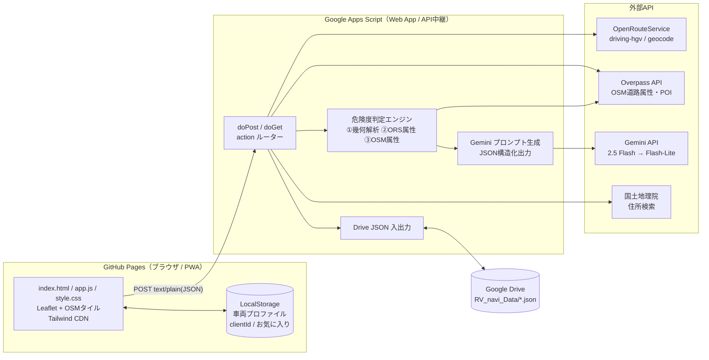
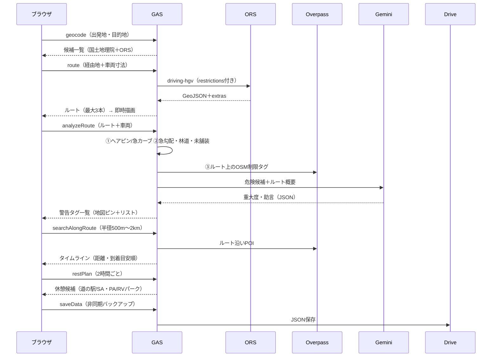

# RV_navi 全体アーキテクチャ設計書（ステップ1）

キャンピングカー専用Webナビ。狭小路・高さ/幅/重量制限を回避し、車中泊・長距離走行を支援する。
リポジトリ名（案）: `RV_navi` ／ 公開先: `https://kenken6291.github.io/RV_navi/`

---

## 1. システム構成図



## 2. 役割定義

| レイヤー | 担当 | 持たないもの |
|---|---|---|
| GitHub Pages | 地図描画、UI、車両プロファイル入力、LocalStorage保存、経由地編集、夜間モード | APIキー |
| GAS | API中継・キー秘匿、ルート探索、危険度判定、POI検索、休憩計画、Drive保存、キャッシュ、レート制限 | 画面 |
| OpenRouteService | HGVプロファイルによる経路探索（高さ・幅・長さ・重量制限を考慮）、勾配/道路種別の付加情報 | 狭路の細かい判定 |
| Overpass API | ルート上の `maxheight` `maxwidth` `maxweight` `maxlength` `width` `narrow` `barrier` の実データ確認、ルート沿いPOI取得 | 経路計算 |
| Gemini API | 機械検出した危険候補の重大度再評価、運転者向け助言文、道路名からの既知の酷道・離合困難区間の指摘、旅程アドバイス | 座標の生成（捏造防止のため禁止） |
| Google Drive | 車両プロファイル・お気に入り・カスタムPOIのJSONバックアップ | — |

## 3. 主要データフロー



ルート描画を先に返し、危険度解析は後から非同期で重ねる2段構成にしている（体感速度優先・GASの6分制限対策）。

## 4. 危険度判定の3層ロジック

| 層 | 入力 | 検出内容 | 信頼性 |
|---|---|---|---|
| ① 幾何解析（GAS内） | ルート座標 | 前後25m区間の方位差で急カーブ・ヘアピン、400m内に3回以上で「連続ヘアピン」。全長7m以上は閾値を下げる | 高（形状そのもの） |
| ② ORS付加情報 | extras | 急勾配（7%以上）、生活道路、林道・作業道、未舗装、渡河、トンネル | 中 |
| ③ OSM実タグ（Overpass） | ルート上の道路 | 高さ/幅/重量/長さ制限が車両を下回る→critical、余裕30cm未満→high、道路幅 < 車幅×2+0.8m→すれ違い困難、車止め・ゲート | 中〜高（登録状況に依存） |
| ④ Gemini | ①〜③＋道路名 | 重大度の再評価、助言文、既知の狭隘路線の指摘 | 参考情報 |

交差する道路（ガード下を走る別の道など）の誤検出を防ぐため、OSMの道路は「ルート座標と2点以上一致するもの」だけを採用する。critical はAIが下げられない仕様。

## 5. API仕様（GAS）

リクエスト（CORS回避のため `Content-Type: text/plain;charset=utf-8`）:

```json
{ "action": "route", "clientId": "xxxxxxxxxxxxxxxxxxxxxxxx", "params": { } }
```

レスポンス: `{ "ok": true, "data": {...} }` または `{ "ok": false, "error": "..." }`
座標は全て **[経度, 緯度]**（GeoJSON順）。

| action | 主なparams | 返却 |
|---|---|---|
| `ping` | — | バージョン |
| `geocode` | `q`, (`lat`,`lng` 近傍優先) | 候補一覧 |
| `reverse` | `lat`, `lng` | 住所ラベル |
| `route` | `waypoints`, `vehicle`, `avoidTolls`, `avoidHighways`, `preference`, `alternatives` | `routes[]`（座標・案内・extras） |
| `analyzeRoute` | `route`, `vehicle`, `useAI` | `hazards[]`, `stats`, `ai`, `osmCoverage` |
| `searchAlongRoute` | `route`, `radius`(300〜2000), `categories[]` | `pois[]`（alongKm・etaMin順） |
| `restPlan` | `route`, `intervalMin`(既定120), `departAt`(ISO) | `stops[]`, 到着時刻、夜間到着フラグ |
| `loadData` / `saveData` | `type`(profile / favorites / customPoi), `data` | JSON / 更新日時 |
| `loadAll` | — | 3種まとめて |

POIカテゴリ: `michinoeki` `rvpark` `camp` `onsen` `fuel` `supermarket` `laundry` `sapa`

## 6. データモデル

車両プロファイル（LocalStorage `cn_vehicle` ／ Drive `profile_<clientId>.json`）:

```json
{
  "name": "我が家のキャンカー",
  "width": 2.0, "height": 2.9, "length": 5.4, "weight": 3.5,
  "drive": "4WD",
  "trailer": false, "trailerLength": 0, "trailerWeight": 0
}
```

GASは安全マージン（高さ・幅 +0.10m）を加えた値をORSへ渡す。トレーラー有りの場合は全長・総重量に加算。

Driveファイル: `RV_navi_Data/{type}_{clientId}.json`
`{ "type", "clientId", "updatedAt", "data" }`

## 7. セキュリティ・ポリシー

| 項目 | 方針 |
|---|---|
| APIキー | GASスクリプトプロパティのみに保存（`GEMINI_API_KEY` / `ORS_API_KEY`）。フロントに置かない |
| 利用者識別 | 初回起動時にブラウザで128bitランダムの `clientId` を生成しLocalStorage保持。会員制は不要な設計だが、将来は既存の会員認証パターン（SHA-256+salt+pepper、CacheServiceセッション）を載せ替え可能 |
| 乱用対策 | Gemini呼び出しは clientId 単位で1時間30回、結果は6時間キャッシュ |
| 広告・トラッカー | 一切読み込まない。外部読み込みはLeaflet・Tailwind CDNとOSMタイルのみ |
| 免責 | OSMは未登録・誤登録があり得るため、必ず現地標識を優先する旨を常時表示 |

## 8. 外部APIの制約（目安・変更の可能性あり）

| API | 注意点 |
|---|---|
| ORS 無料枠 | Directions 約2,000回/日・40回/分、Geocode 約1,000回/日。代替ルートは直線95km以内かつ経由地なしの時のみ要求 |
| ORS driving-hgv | トラック基準の速度のため所要時間はやや長めに出る |
| Overpass | 公共サーバーは混雑で429/504あり。2エンドポイント＋リトライ。長距離ルートは約16区間まで確認し、未確認範囲を `osmCoverage` で返す |
| GAS | 1実行6分。解析は5分で打ち切り、部分結果を返す |
| Gemini | 2.5 Flash失敗時は Flash-Lite に自動切替 |

## 9. ファイル構成（予定）

```
RV_navi/
├─ index.html
├─ app.js
├─ style.css
├─ manifest.json / sw.js   （ステップ4でPWA化）
├─ ARCHITECTURE.md
└─ gas/
   └─ Code.gs
```

## 10. 今後のステップ

| ステップ | 内容 |
|---|---|
| 3 | フロント実装（Leaflet描画、車両モーダル、ルート描画、危険タグ、POIタイムライン、経由地挿入） |
| 4 | 休憩提案UI、夜間進入路の広さスコア（POI周辺の道路種別・幅から算出）、PWA・ダークモード |
| 5 | お気に入り・カスタムPOIの同期、オフライン時の直近ルート保持 |
